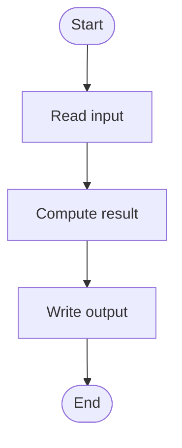
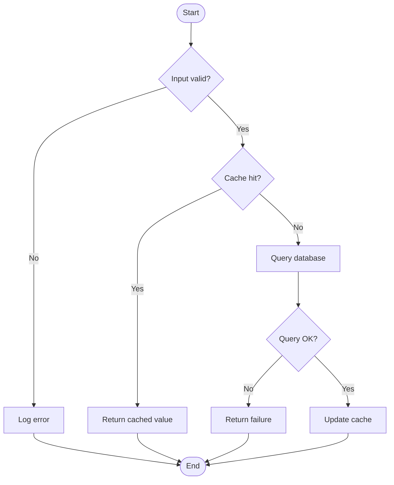
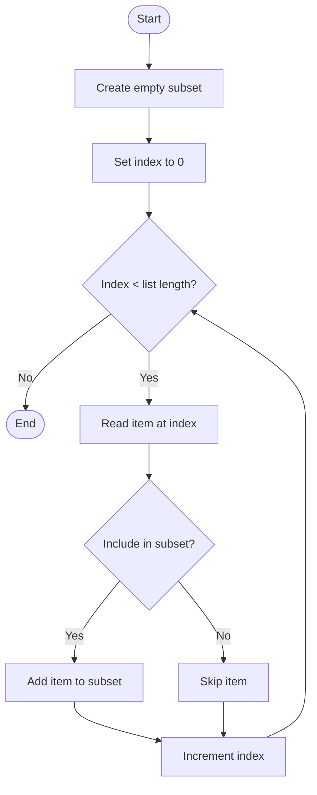

export const metadata = {
  title: "Cyclomatic Complexity",
  date: "2026-07-05T19:57:08",
  description: "",
  tags: [],
}

<Bibliography items={[
  {
    id: 'mccabe-1976',
    authors: 'T. J. McCabe',
    title: 'A Complexity Measure',
    journal: 'IEEE Transactions on Software Engineering',
    volume: 2,
    issue: 4,
    pages: '308-320',
    date: '1976-12-01',
    url: 'https://doi.org/10.1109/tse.1976.233837',
  },
  {
    id: 'orwell-politics-english',
    authors: 'G. Orwell',
    title: 'Politics and the English Language',
    publisher: 'Horizon',
    date: '1946-04-01',
    url: 'https://www.orwellfoundation.com/the-orwell-foundation/orwell/essays-and-other-works/politics-and-the-english-language/',
    accessed: '2026-07-05',
  },
  {
    id: 'sre-simplicity',
    authors: 'M. Luebbe',
    title: 'Simplicity',
    bookTitle: 'Site Reliability Engineering',
    editor: 'T. Harvey',
    publisher: "O'Reilly Media",
    date: '2017',
    url: 'https://sre.google/sre-book/simplicity/',
    accessed: '2026-07-05',
  },
]}>

1. Cyclomatic complexity - what is it, how is it calculated and how will we apply it to ApigeeX
2. What are the limitations and drawbacks to cyclomatic complexity, and indeed all computational metrics
3. What are some gold standard metrics we should include, but cannot compute?

# Cyclomatic complexity

Cyclomatic complexity defines the number of predicates in a system.

```javascript
if (x > 0) {
  return 'positive'
}
```

```
D + 1
```

All programs can be made into flow charts:

Simplest program (1):


Simple read from database (4):


Simple list filter (3):


# Calculating cyclomatic complexity in ApigeeX

```html
<Condition>a == 'true' && b == 'true'</Condition>
```

Javascript?

# Intersystem complexity? Microservices? What is independence of one piece of code from another? Shared libraries?

# Limitations and drawbacks to cyclomatic complexity

## Cognitive complexity

```javascript
function sumOfPrimes(max) { // +1
  let total = 0
  outer: for (let i = 1; i <= max; ++i) { // +1
    for (let j = 2; j < i; ++j) { // +1
      if (i % j === 0) { // +1
        continue outer
      }
    }
    total += i
  }
  return total
} // Cyclomatic Complexity 4
```

```javascript
function getWords(number) { // +1
  switch (number) {
    case 1: // +1
      return 'one'
    case 2: // +1
      return 'a couple'
    case 3: // +1
      return 'a few'
    default:
      return 'lots'
  }
} // Cyclomatic Complexity 4
```

<Quote>The only situation in which this limit has seemed unreasonable is when a large number of independent cases followed a selection function (a large case statement)...<Ref n={1} /></Quote>

## Fundamental limitations of syntactic analysis

<Quote>I returned and saw under the sun, that the race is not to the swift, nor the battle to the strong, neither yet bread to the wise, nor yet riches to men of understanding, nor yet favour to men of skill; but time and chance happeneth to them all.<Ref n={2} /></Quote>

<Quote>Objective consideration of contemporary phenomena compels the conclusion that success or failure in competitive activities exhibits no tendency to be commensurate with innate capacity, but that a considerable element of the unpredictable must invariably be taken into account.<Ref n={2} /></Quote>

## But so what? It is still useful in conjunction with other proxies for quality

# Cool metrics

<Quote>How long does it take to explain a comprehensive high-level view of the service to a new team member—for example, diagram the architecture on a whiteboard and walk through each component's function and dependencies?<Ref n={3} /></Quote>

<Quote>How long before a new team member can go on-call?<Ref n={3} /></Quote>

Do we have good system diagrams across our services for use by on-call engineers?

How many steps are needed to answer questions? Multiple dashboards and areas of investigation obfuscate answers to questions.

## Appendix A — JavaScript predicate syntaxes

### `if` / `else if`

```javascript
if (x > 0) {
  return 'positive'
} else if (x < 0) {
  return 'negative'
}
```

### `&&` and `||`

```javascript
if (user.hasName && user.active) {
  greet(user)
}
```

equivalent to

```javascript
if (user.hasName) {
  if (user.active) {
    greet(user)
  }
}
```

<Quote>
In practice compound predicates such as `IF "C1 AND C2" THEN` are treated as contributing two to complexity since without the connective `AND` we would have `IF C1 THEN IF C2 THEN` which has two predicates. For this reason and for testing purposes it has been found to be more convenient to count conditions instead of predicates when calculating complexity.<Ref n={1} />
</Quote>

### `switch`

```javascript
switch (status) {
  case 'ok': return data
  case 'fail': throw new Error()
  default: return null
}
```

### `while`

```javascript
while (i > 0) {
  i--
}
```

### `for` (three-part)

```javascript
for (let i = 0; i < n; i++) {
  sum += i
}
```

### `for…of`

```javascript
for (const item of list) {
  process(item)
}
```

### Ternary (tool-dependent)

```javascript
return ok ? 'yes' : 'no'
```

### `catch` (tool-dependent)

```javascript
try {
  parse(raw)
} catch {
  return null
}
```

Some tools count this as a branch onto the exceptional path.

### `.filter` and various callbacks

```javascript
items.filter(x => x > 0)
```

# Appendix B - Why Predicates + 1?:

When defining the floor for complexity, we can imagine that it could be 0 or 1. The idea is that, regardless of the complexity of our code, by having code, we do not have nothing, we have something, and something is not well represented by nothing i.e. 0.

# Appendix C - Goodhart's Law

<Quote>When a measure becomes a target, it ceases to be a good measure - Goodhart's Law</Quote>

The same way we shouldn't pay programmers in lines of code, we shouldn't make syntactic analysis a chase-metric.

### References

</Bibliography>